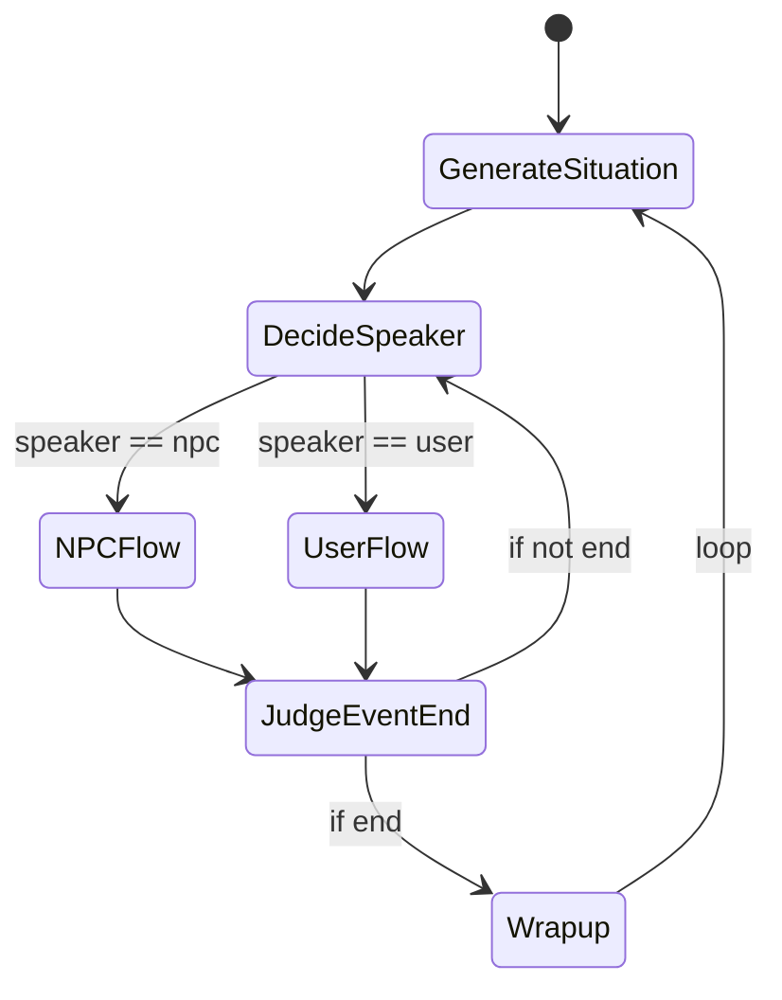
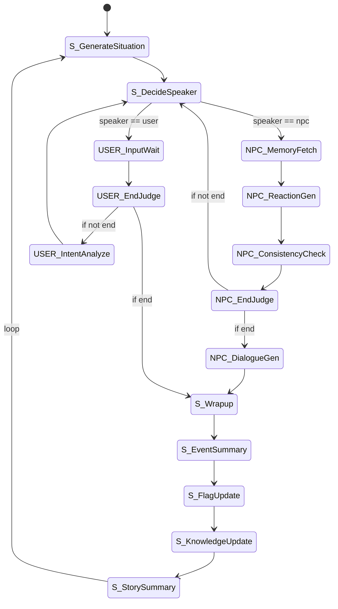
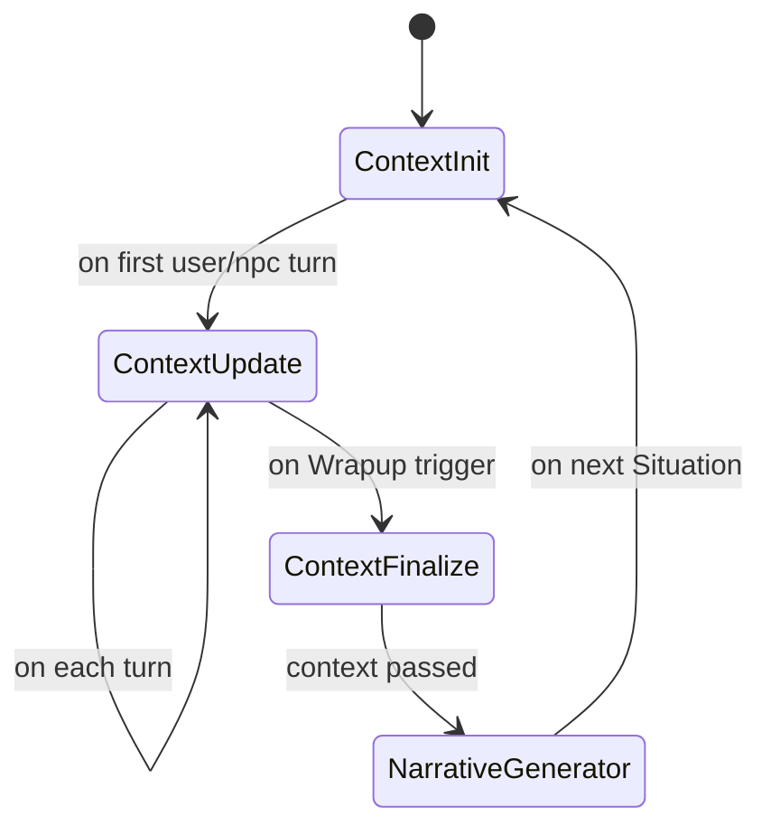
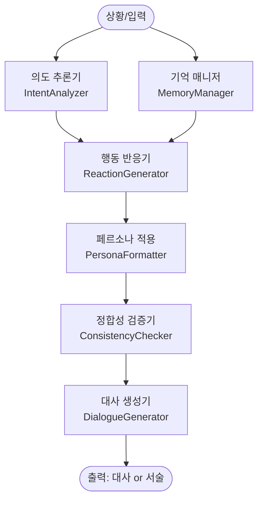

# 서사 상태 흐름 요약

```mermaid
stateDiagram-v2
    [*] --> GenerateSituation

    GenerateSituation --> DecideSpeaker

    DecideSpeaker --> NPCFlow : speaker == npc
    DecideSpeaker --> UserFlow : speaker == user

    NPCFlow --> JudgeEventEnd
    UserFlow --> JudgeEventEnd

    JudgeEventEnd --> DecideSpeaker : if not end
    JudgeEventEnd --> Wrapup : if end

    Wrapup --> GenerateSituation : loop
```
# 서사 상태 흐름 전체

```mermaid
stateDiagram-v2
    [*] --> S_GenerateSituation

    S_GenerateSituation --> S_DecideSpeaker

    S_DecideSpeaker --> NPC_MemoryFetch : speaker == npc
    S_DecideSpeaker --> USER_InputWait : speaker == user

    %% --- NPC 흐름 ---
    NPC_MemoryFetch --> NPC_ReactionGen
    NPC_ReactionGen  --> NPC_ConsistencyCheck
    NPC_ConsistencyCheck --> NPC_EndJudge
    NPC_EndJudge --> S_DecideSpeaker : if not end
    NPC_EndJudge --> NPC_DialogueGen : if end
    NPC_DialogueGen --> S_Wrapup 

    %% --- 유저 흐름 ---
    USER_InputWait  --> USER_EndJudge
    USER_EndJudge --> USER_IntentAnalyze: if not end
    USER_IntentAnalyze--> S_DecideSpeaker 
    USER_EndJudge --> S_Wrapup : if end

    %% --- Wrapup 흐름 ---
    S_Wrapup --> S_EventSummary
    S_EventSummary --> S_FlagUpdate
    S_FlagUpdate --> S_KnowledgeUpdate
    S_KnowledgeUpdate --> S_StorySummary
    S_StorySummary --> S_GenerateSituation : loop

```

# 언어모델 컨텍스트 관리 

```mermaid
stateDiagram-v2
    [*] --> ContextInit

    ContextInit --> ContextUpdate : on first user/npc turn
    ContextUpdate --> ContextUpdate : on each turn
    ContextUpdate --> ContextFinalize : on Wrapup trigger
    ContextFinalize --> NarrativeGenerator : context passed
    NarrativeGenerator --> ContextInit : on next Situation

```

# 캐릭터 출력 관리

```mermaid
flowchart TD
    Start(["상황/입력"])
    Start --> Intent[의도 추론기<br>IntentAnalyzer]
    Start --> Memory[기억 매니저<br>MemoryManager]

    Intent --> Reaction[행동 반응기<br>ReactionGenerator]
    Memory --> Reaction

    Reaction --> Persona[페르소나 적용<br>PersonaFormatter]
    Persona --> Consistency[정합성 검증기<br>ConsistencyChecker]

    Consistency --> Dialogue[대사 생성기<br>DialogueGenerator]
    Dialogue --> Output(["출력: 대사 or 서술"])
```